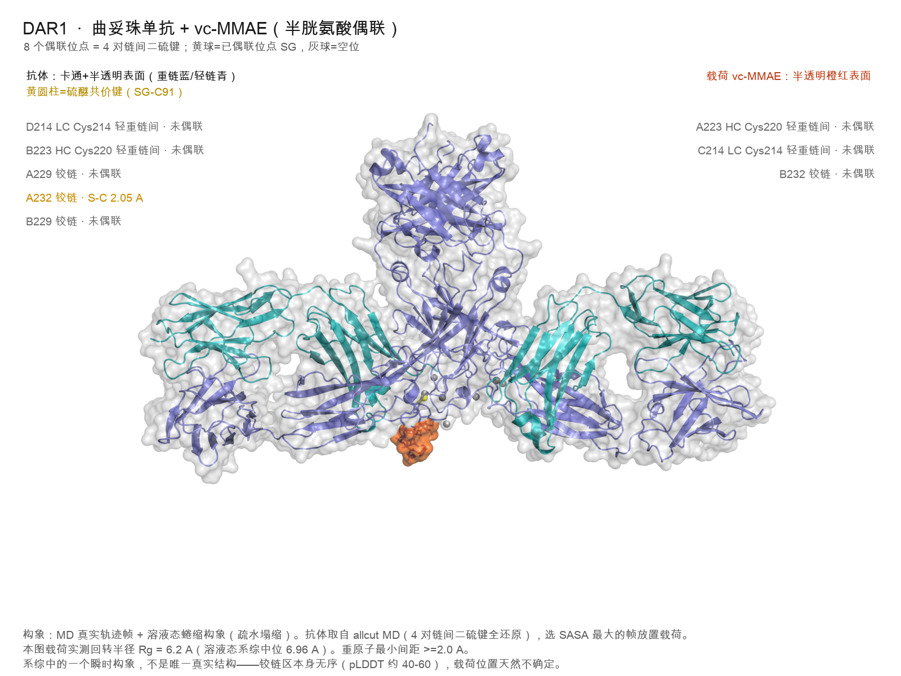
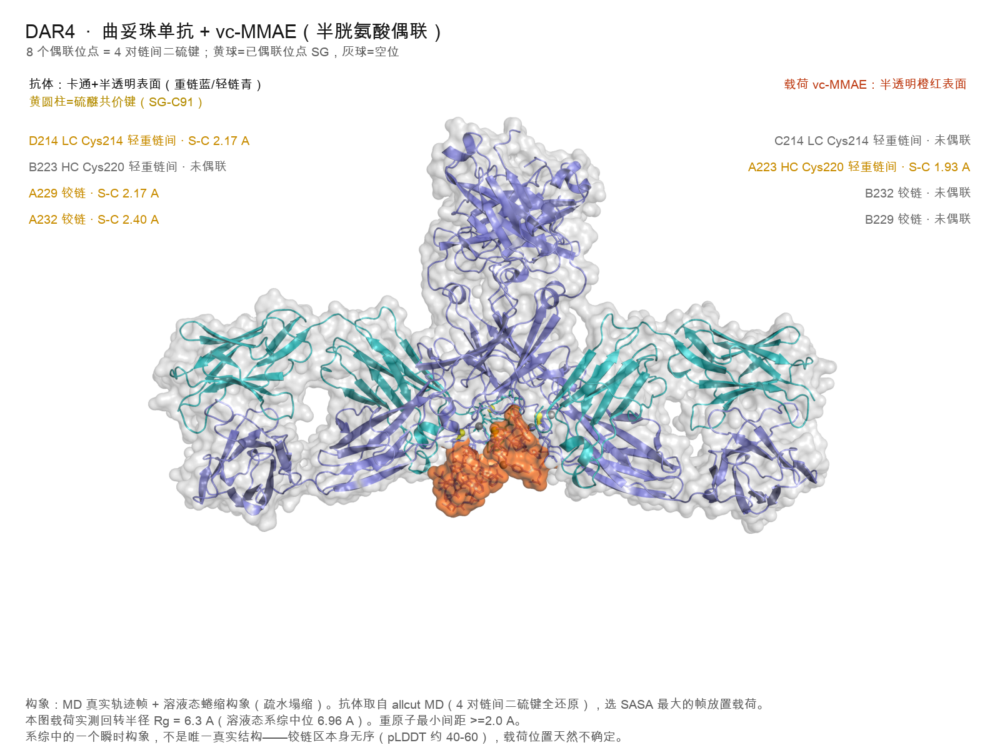
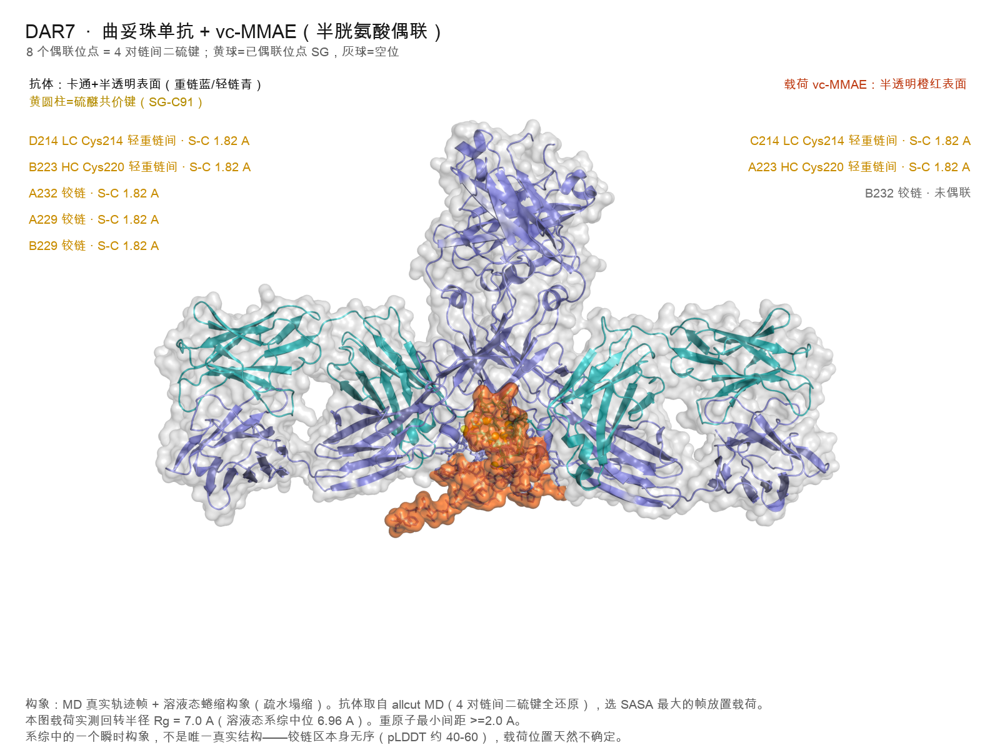

# IgG1-ADC-conjugation-model — DAR v6 process model

Main model: `dar_v6_complete.py`. Python package name is `adcsim`.

  

Computational **IgG1 cysteine-conjugation** model. Given an antibody structure,
a reduction profile, an MD exposure library and a set of process conditions, it
predicts the **DAR distribution** (drug-to-antibody ratio 0–8) and attributes
which step limits the loading.

> **This is a computational prediction, not an experimental measurement.**
> `computational DAR prediction ≠ experimental DAR distribution`. The numbers
> come out of the model defined below; they are only comparable to HIC / LC-MS
> after the model has been calibrated on measured batches of the **same**
> antibody. Nothing here is a substitute for a wet-lab DAR assay.

**Model identity (v1):** *IgG1 cysteine conjugation model. `K` is an
antibody-specific calibration parameter.* It is fitted from measured anchors of
one antibody and is **not** transferable to another antibody without
re-calibration.

---

## 1. What it answers

*Given this antibody, this linker–payload and these process conditions (TCEP
equivalents, temperature, pH, time, antibody concentration, payload feed), what
DAR distribution comes out — and which step is holding the loading back?*

It answers **"how many payloads end up attached"**. It does **not** answer
payload release, potency, PK, toxicity, aggregation or stability.

## 2. Two entry points

One antibody, one linker-payload, one process recipe. The repository answers
**two different questions** about that system:

| | **A - process model** | **B - structure pipeline** |
|---|---|---|
| question | how many payloads attach, and which step limits it | what the conjugate looks like in 3D |
| entry | `examples/trop_adc/kaggle_md_8site/dar_v6_complete.py` | `bin/adcsim examples/trop_adc/config.yaml` |
| code | one self-contained 2600-line script (numpy only) | the `packages/adcsim/` library (`python -m adcsim`) |
| output | DAR 0-8 distribution, limiting-step attribution, inverse process window | placed ADC structures (`ADC_DAR*.pdb`), steric QC, PyMOL renders |

Both consume the same eight released cysteines (4 interchain disulfides), the
same reduction profile and the same process config. The rest of this README is
about entry **A**; the renders below come from entry **B**.

### What the structure pipeline produces

PyMOL renders of the placed conjugates at DAR 1, 4 and 7
(`examples/trop_adc/results_hinge/pymol_images/adc_DAR*.png`). Heavy chain:
slate blue; light chain: teal; vc-MMAE payload: orange surface. Labels at
engaged sites give the SG-C91 thioether bond length; greyed-out sites stayed
unconjugated. (In-image annotations are in Chinese: 重链 = heavy chain,
轻链 = light chain, 未偶联 = unconjugated.)







*Trastuzumab + vc-MMAE, cysteine conjugation. Each structure is a single
MD-frame snapshot of the fully reduced antibody with a collapsed-dominant
payload ensemble; the hinge is intrinsically disordered (pLDDT about 40-60),
so payload placement is one plausible representation, not a unique structure.
Heavy-atom clearance >= 2.0 A was enforced at every placed site.*

## 3. Inputs

| input | file / source | what it carries |
|---|---|---|
| reduction profile | `examples/trop_adc/results_hinge/ss_reduction_profile.json` | per-bond `reduction_ease` + `local_net_charge` — this is what the model actually reads |
| MD exposure | `examples/trop_adc/results_hinge/*_v5_sasa.npy` | per-frame SASA for 4 sites (other 4 mirrored) |
| process + chemistry | `examples/trop_adc/kaggle_md_8site/adc_model_config.yaml` | TCEP eq, temperatures, pH, times, `[mAb]`, feed, thresholds |
| calibration anchors | `anchors:` in the yaml | measured (TCEP eq → DAR) points, with their own temperature / [mAb] / time |

**The main model does not open a PDB file at runtime.** `dar_v6_complete.py`
imports only `json`, `numpy`, `yaml` and `argparse`. Everything structural
reaches it pre-computed, through the reduction profile.

The upstream chain is:

```
B220_235_disulfide_repaired.pdb              examples/trop_adc/data/  (ships here)
   │   ── packages/adcsim/sites.py :: reduction_difficulty_profile()
   │      oxidised-state static SG SASA + geometry strain + local charge
   ▼
ss_reduction_profile.json                    (read by the main model)
```

To run this on a **different antibody**, regenerate the profile with
`packages/adcsim/sites.py :: reduction_difficulty_profile(pairs, model)` from
that antibody's structure, then re-fit `K` on its own measured anchors.
There is no one-command "new sequence → DAR" path — see section 10.

Every number lives in the config; the code contains no magic numbers. A config
path can be switched with the `ADCSIM_CONFIG` environment variable.

## 4. Computation flow

```
Input (structure + profile + MD + config)
  │
  ├─ Step 1  site accessibility   per-frame SASA → effective exposure time t_eff
  │                               (8 sites: 4 measured, 4 mirrored by symmetry)
  ├─ Step 2  thiol activation     thiolate fraction from exposure-conditioned pKa
  │                               (pKa 8.5; enters via k2_apparent pH ratio, not a second factor)
  ├─ Step 3  covalent conjugation p_c = YIELD * (1 - exp(-k2_apparent * AUC))
  │                               AUC carries payload concentration + hydrolysis
  ├─ Step 4  disulfide reduction  4 bonds share ONE TCEP pool; stoichiometric cap.
  │                               Single fitted parameter K = k_TCEP × [mAb] × t_reduction,
  │                               fitted from the anchors, then corrected for
  │                               temperature (Arrhenius) and pH (TCEP pKa 7.6).
  ├─ Step 5  combinatorial stats  4 disulfide-PAIR convolution (each pair gives 0/1/2)
  │                               → DAR 0..8 distribution (not 8 independent Bernoulli)
  └─ Step 6  uncertainty + inverse Monte-Carlo range; target DAR → TCEP eq;
                                  minimum payload feed; LP bottleneck check
  │
Output: results_hinge/dar_v6_complete.json (+ optional dual-payload / glycan branches)
```

Two independent optional branches hang off the same site logic:
**dual payload** (two payloads competing for the same thiols) and
**glycan conjugation** (N297, a different chemistry, disabled by default).

## 5. Main modelling assumptions

1. **IgG1 only**, wild-type interchain cysteines (2 heavy–heavy hinge + 2 heavy–light = 4 bonds = 8 sites).
2. **Shared reductant pool**: one TCEP reduces one disulfide; opened bonds ≤ min(TCEP eq, 4).
3. **Exposure-conditioned pKa** (8.5) replaces the buried-conformer static pKa — otherwise burial is counted twice.
4. `k2_ref = 300 M⁻¹s⁻¹` is an **apparent** rate at pH 7; pH moves it by the thiolate **ratio**, never by multiplying thiolate twice.
5. **K is antibody-specific.** It is calibrated per antibody from measured anchors.
6. Once released, thiols conjugate independently; **no disulfide scrambling, no intrachain consumption (`eta=1.0`), no trisulfide** handling.
7. In the default process window the per-site conjugation probability is **saturated (p_c = 0.995)**, so the DAR is set by **disulfide reduction**, not by differences between the 8 sites. The MD exposure differences therefore do **not** drive the default result.

## 6. Output

`dar_v6_complete.json` — DAR distribution (0–8), mean / mode / std, even:odd
ratio, `P(DAR>=6)`, 95 % **uncertainty range** (Monte-Carlo, not a frequentist
CI), per-site detail, temperature scan, leave-one-out validation, inverse-solve
process window, LP bottleneck, and the calibration diagnostics (`K_open`,
`k_TCEP`, residuals).

## 7. How to run

### Install

Python ≥ 3.10. Dependencies are declared in `pyproject.toml`:

```bash
pip install numpy scipy biopython rdkit pyyaml pytest
# or: pip install -e .
```

The main model itself needs only `numpy`, `scipy` and `pyyaml`;
`biopython` / `rdkit` are needed by the structure and payload-QC tests.

Note that `pip install -e .` installs the **entry-B** package (`adcsim`) only.
The DAR model (entry A) is a standalone script run directly from
`examples/trop_adc/kaggle_md_8site/`; nothing needs to be installed for it
beyond `numpy`, `scipy` and `pyyaml`.

### Minimal run

Reduction temperature is **mandatory** (there is deliberately no default —
reduction temperature is a real process input, so the model refuses to guess
one):

```bash
cd examples/trop_adc/kaggle_md_8site
python dar_v6_complete.py --reduction-temp 37
```

Results are written to `examples/trop_adc/results_hinge/dar_v6_complete.json`.
The run prints a DAR 0–8 distribution. The line to check is

```
mean = 4.587   mode = 4   even/odd = 43.346   P(DAR>=6) = 0.4215
```

If you instead get `mean = 0.000` with every site marked `NO DATA`, the
per-frame SASA arrays (`results_hinge/*_v5_sasa.npy`) are missing — see the
end of section 13.

### CLI

| flag | meaning |
|---|---|
| `--reduction-temp` | reduction temperature °C (**required** here or in the config) |
| `--conjugation-temp` | conjugation temperature °C (default 22) |
| `--profile` | reduction-ease profile json |
| `--pc-json` | `{site: p_c}` override for a structure with no MD |
| `--out` / `--tag` | output path / run label |
| `--target-dar` | extra target mean DAR for the inverse table (repeatable) |
| `--mab-um` / `--tcep-eq` / `--reduction-time-h` / `--payload-feed` | per-run process overrides |
| `--payload-a` / `--payload-b` / `--feed-a` / `--feed-b` / `--k-ratio` / `--class-factor` | dual payload |
| `--glycan` (+ `--glycan-sites`, `--glycan-per-site`, `--glycan-anchor-dar`, `--glycan-eff`) | run the N297 glycan branch instead of the cysteine route |

## 8. Reproducibility

* Random seed `20260918`, Monte-Carlo `n_mc=4000` (fixed in config).
* All parameters externalised to `adc_model_config.yaml`; `ADCSIM_CONFIG` can point at another config.
* Locked reference numbers are asserted by the test suite (`tests/conftest.py: LOCKED`).

## 9. Validation / regression

```
pytest tests/          # ~160 s
```
→ **120 passed, 1 skipped, 0 failed.**

The single skip is deliberate and is **not** a missing or hidden test:
`tests/` contains 121 tests in total; the one skipped test reads the full
molecular-dynamics trajectory (`data/md_af_nolock/allcut_r2.npz`, 226 MB).
That file is **not shipped** — it exceeds GitHub's 100 MiB per-file limit.
The test skips cleanly with a printed reason when the file is absent, so a
fresh clone reports `1 skipped` rather than an error. Everything else,
including every locked value below, runs on a fresh clone with no external
data.

Locked values asserted by the suite:

| locked value | value |
|---|---|
| `K_open` (37 °C, 67 µM, 2 h) | **1.1869** |
| mean DAR @ TCEP 2.5 eq | **4.587** |
| mode DAR | **4** |
| even/odd ratio | **43.346** |
| leave-one-out MAE | **0.0547** DAR |
| sites / bonds | 8 / 4 |

Anchor residuals (predicted − measured mean DAR): `-0.004 / +0.051 / +0.037 / -0.058`.
Implied `k_TCEP = 2.46 M⁻¹s⁻¹`, inside the literature range for TCEP opening
protein disulfides (1.5–6.25 M⁻¹s⁻¹).

## 10. Scope — what v1 can and cannot do

**Can:** predict the DAR response of **the same antibody** to process changes
(TCEP equivalents, reduction temperature / time / pH, antibody concentration,
payload feed), and attribute the limiting step.

**Cannot:** predict the absolute DAR of a **new antibody sequence** (no
exposure/accessibility input, and `K` changes with the antibody — see the
Brentuximab case, `k_TCEP` 0.816 vs trastuzumab 2.36). Cannot predict release,
potency, PK, toxicity, aggregation or shelf stability.

## 11. Known limitations (recorded, not bugs)

| limitation | status |
|---|---|
| `Ea = 53 kJ/mol` back-derived from Q10≈2 — **not measured** | Tier C; no effect at equal temperature |
| 4 of 8 sites use mirrored MD (no own frames) | Tier C; saturated p_c makes it inert in the default window |
| `volume_exclusion_factor` hard-sphere approximation | Tier C; ≈1 at anchor concentration |
| `charge_factor` 0.3 screening coefficient | Tier C, folded into ease before fitting, absorbed by `K` |
| CAC / σ anchored on one payload pair | Tier C; only engages for payloads with a measured anchor |
| glycan `eff_total = 1.0` placeholder | Tier C; branch is **off** by default and needs an anchor |
| no scrambling / intrachain / trisulfide / ADC aggregation / heterogeneity | known simplifications |

## 12. Future work

* continuous steric discount (site fit → probability, not pass/fail)
* wire the `conjugation_ceiling()` diagnostic into the output (currently defined, not called)
* glycan anchor, and `K` predicted from structural descriptors (needs 20+ antibodies)
* expand the anchor set from public patents / literature

## 13. Repository layout

```
IgG1-ADC-conjugation-model/          ← this repository
├── examples/trop_adc/
│   ├── kaggle_md_8site/dar_v6_complete.py   ← MAIN MODEL (this README)
│   │   └── adc_model_config.yaml
│   ├── results_hinge/                        profiles, MD SASA, outputs, PyMOL renders
│   └── data/                                structures, payload ensembles, anchors
├── packages/adcsim/                         supporting library
│   ├── seqqc.py         sequence QC / topology entry
│   ├── sites.py         disulfide detection, resolve by conjugation type
│   ├── chemistry.py     warhead → conjugation-type classifier
│   ├── payload_qc.py    linker-payload QC (exposure, solubility, sterics)
│   ├── io.py            PDB / MD frame loading (nm→Å handled here)
│   └── ...              pipeline, accessibility, clash, alarms, report
└── tests/                                   121 tests
                                             (120 run, 1 skipped — needs the
                                              226 MB MD trajectory, not shipped)
```

Not shipped, by design:

```
data/md_af_nolock/allcut_r*.npz      full MD trajectories, 4 x 226 MB
                                     — over GitHub's 100 MiB per-file limit.
                                     Publish separately as a release asset or
                                     via Git LFS if you need them.
```

The per-frame SASA arrays actually consumed by the model
(`results_hinge/<site>_v5_sasa.npy`, ~7 KB each) **are** shipped — without
them every site reports `NO DATA` and DAR silently collapses to 0.

## 14. License / status

Released under the **MIT License** — see [`LICENSE`](LICENSE).
Copyright `adcsim contributors`.

Research code — **not a validated drug-development tool**. Outputs are
decision-support for process development and must be confirmed by HIC / LC-MS
before being treated as fact.
